# ⚙️ Triggers y Automatización

Sistema completo de triggers, funciones y automatización en COREBOARD.

## 🎯 Triggers Principales

### Actualización Automática de `updated_at`

```sql
-- Función helper para timestamps
CREATE OR REPLACE FUNCTION public.update_updated_at()
RETURNS trigger
LANGUAGE plpgsql
AS $$
BEGIN
  NEW.updated_at = now();
  RETURN NEW;
END;
$$;

-- Aplicar a todas las tablas modificables
CREATE TRIGGER update_orgs_updated_at
  BEFORE UPDATE ON app.orgs
  FOR EACH ROW EXECUTE FUNCTION public.update_updated_at();

CREATE TRIGGER update_salons_updated_at
  BEFORE UPDATE ON public.salons
  FOR EACH ROW EXECUTE FUNCTION public.update_updated_at();

CREATE TRIGGER update_appointments_updated_at
  BEFORE UPDATE ON public.appointments
  FOR EACH ROW EXECUTE FUNCTION public.update_updated_at();
```

**Flujo de ejecución:**
```mermaid
graph LR
    A[UPDATE tabla] --> B[BEFORE UPDATE Trigger]
    B --> C[update_updated_at()]
    C --> D[NEW.updated_at = now()]
    D --> E[Continuar UPDATE]
```

### Cálculo Automático de Totales

```sql
-- Trigger para recalcular total de turno
CREATE OR REPLACE FUNCTION public.calculate_appointment_total()
RETURNS trigger
LANGUAGE plpgsql
AS $$
BEGIN
  -- Recalcular total cuando cambian los items
  UPDATE public.appointments
  SET total_amount = (
    SELECT COALESCE(SUM(ai.price * ai.quantity), 0)
    FROM public.appointment_items ai
    WHERE ai.appointment_id = NEW.appointment_id
  )
  WHERE id = NEW.appointment_id;

  RETURN NEW;
END;
$$;

CREATE TRIGGER calculate_appointment_total_trigger
  AFTER INSERT OR UPDATE OR DELETE ON public.appointment_items
  FOR EACH ROW EXECUTE FUNCTION public.calculate_appointment_total();
```

**Secuencia de cálculo:**

```mermaid
sequenceDiagram
    participant U as Usuario
    participant T as Trigger
    participant DB as Base de Datos

    U->>DB: INSERT appointment_items
    DB->>T: AFTER INSERT trigger
    T->>DB: UPDATE appointments SET total_amount = SUM(items)
    DB->>T: Confirmación
    T->>U: Operación completada
```


### Generación Automática de Comisiones

```sql
CREATE OR REPLACE FUNCTION public.generate_commission()
RETURNS trigger
LANGUAGE plpgsql
AS $$
DECLARE
  emp_commission_rate numeric;
  service_amount numeric;
  emp_active boolean;
  emp_in_salon boolean;
BEGIN
  -- Solo generar cuando turno se completa
  IF NEW.status = 'completed' AND (OLD.status IS NULL OR OLD.status != 'completed') THEN

    -- Validar que empleado existe y está activo
    SELECT default_commission_pct, active INTO emp_commission_rate, emp_active
    FROM app.employees
    WHERE id = NEW.employee_id
      AND user_id IS NOT NULL  -- Regla de oro
      AND deleted_at IS NULL;

    IF NOT FOUND OR NOT emp_active THEN
      RAISE EXCEPTION 'employee_not_found_or_inactive' USING ERRCODE = 'PT400';
    END IF;

    -- Validar que empleado está asignado al salón
    SELECT EXISTS (
      SELECT 1 FROM public.salon_employees
      WHERE salon_id = NEW.salon_id
        AND employee_id = NEW.employee_id
        AND active = true
    ) INTO emp_in_salon;

    IF NOT emp_in_salon THEN
      RAISE EXCEPTION 'employee_not_in_salon' USING ERRCODE = 'PT400';
    END IF;

    -- Calcular monto de servicios
    SELECT SUM(price * quantity) INTO service_amount
    FROM public.appointment_items
    WHERE appointment_id = NEW.id;

    -- Crear comisión si aplica
    IF emp_commission_rate > 0 AND service_amount > 0 THEN
      INSERT INTO public.commissions (
        org_id, employee_id, appointment_id,
        amount, commission_rate, date
      ) VALUES (
        NEW.org_id, NEW.employee_id, NEW.id,
        service_amount * (emp_commission_rate / 100.0), emp_commission_rate, NEW.date
      );
    END IF;
  END IF;

  RETURN NEW;
END;
$$;

CREATE TRIGGER generate_commission_trigger
  AFTER UPDATE ON public.appointments
  FOR EACH ROW EXECUTE FUNCTION public.generate_commission();
```

### Validación de Turnos (Reglas de Negocio)

```sql
-- Función para validar turno antes de insertar
CREATE OR REPLACE FUNCTION public.validate_appointment()
RETURNS trigger
LANGUAGE plpgsql
AS $$
DECLARE
  emp_in_salon boolean;
  emp_active boolean;
  emp_has_user boolean;
BEGIN
  -- Validar que empleado existe y tiene user_id (regla de oro)
  SELECT EXISTS (
    SELECT 1 FROM app.employees
    WHERE id = NEW.employee_id
      AND user_id IS NOT NULL
      AND active = true
      AND deleted_at IS NULL
  ) INTO emp_has_user;

  IF NOT emp_has_user THEN
    RAISE EXCEPTION 'employee_missing_user_or_inactive' USING ERRCODE = 'PT400';
  END IF;

  -- Validar que empleado está asignado al salón
  SELECT EXISTS (
    SELECT 1 FROM public.salon_employees
    WHERE salon_id = NEW.salon_id
      AND employee_id = NEW.employee_id
      AND active = true
  ) INTO emp_in_salon;

  IF NOT emp_in_salon THEN
    RAISE EXCEPTION 'employee_not_in_salon' USING ERRCODE = 'PT400';
  END IF;

  -- Validar conflictos horarios (opcional - puede ser más complejo)
  -- Se puede implementar aquí o en el frontend con turnosStore.checkConflicts()

  RETURN NEW;
END;
$$;

CREATE TRIGGER validate_appointment_trigger
  BEFORE INSERT OR UPDATE ON public.appointments
  FOR EACH ROW EXECUTE FUNCTION public.validate_appointment();
```

## 🔧 Funciones RPC

### Claim Invitación (Segura)

```sql
CREATE OR REPLACE FUNCTION public.claim_invitation(p_token text)
RETURNS jsonb
LANGUAGE plpgsql
SECURITY DEFINER
SET search_path = public
AS $$
DECLARE
  v_user_id uuid := auth.uid();
  v_email text;
  v_inv public.invitations%ROWTYPE;
  v_hash bytea := digest(p_token, 'sha256');
BEGIN
  -- 1. Validar autenticación
  IF v_user_id IS NULL THEN
    RAISE EXCEPTION 'auth_required' USING ERRCODE = 'PT401';
  END IF;

  -- 2. Obtener email del usuario
  SELECT email INTO v_email FROM auth.users WHERE id = v_user_id;

  -- 3. Buscar invitación (FOR UPDATE = atomic)
  SELECT * INTO v_inv
  FROM public.invitations
  WHERE token_hash = v_hash
    AND used_at IS NULL
    AND now() < expires_at
  FOR UPDATE;

  -- 4. Validaciones
  IF NOT FOUND THEN
    RAISE EXCEPTION 'invalid_or_expired_or_used' USING ERRCODE = 'PT403';
  END IF;

  IF v_inv.email IS NOT NULL AND lower(v_inv.email) <> lower(v_email) THEN
    RAISE EXCEPTION 'email_mismatch' USING ERRCODE = 'PT403';
  END IF;

  -- 5. Crear membresía (idempotent)
  INSERT INTO public.memberships(org_id, user_id, role)
  VALUES (v_inv.organization_id, v_user_id, v_inv.role)
  ON CONFLICT (org_id, user_id) DO UPDATE SET role = EXCLUDED.role;

  -- 6. Marcar como usado
  UPDATE public.invitations
  SET used_at = now(), used_by = v_user_id
  WHERE id = v_inv.id;

  -- 7. Retornar resultado
  RETURN jsonb_build_object(
    'organization_id', v_inv.organization_id,
    'role', v_inv.role
  );
END;
$$;
```

**Diagrama de ejecución:**

```mermaid
stateDiagram-v2
    [*] --> ValidarAuth
    ValidarAuth --> BuscarInvitacion: user_id OK
    ValidarAuth --> Error401: user_id NULL

    BuscarInvitacion --> ValidarToken: invitación encontrada
    BuscarInvitacion --> Error403: no encontrada

    ValidarToken --> ValidarEmail: token válido
    ValidarToken --> Error403: token expirado/usado

    ValidarEmail --> CrearMembresia: email OK
    ValidarEmail --> Error403: email mismatch

    CrearMembresia --> MarcarUsado
    MarcarUsado --> RetornarExito
    RetornarExito --> [*]

    Error401 --> [*]
    Error403 --> [*]
```


### Funciones Helper

```sql
-- Verificar membresía en org
CREATE OR REPLACE FUNCTION public.user_is_member_of(org_id uuid)
RETURNS boolean
LANGUAGE sql
SECURITY DEFINER
AS $$
  SELECT EXISTS (
    SELECT 1 FROM public.memberships
    WHERE user_id = auth.uid() AND org_id = $1
  );
$$;

-- Verificar rol específico
CREATE OR REPLACE FUNCTION public.user_has_role_in_org(org_id uuid, required_role text)
RETURNS boolean
LANGUAGE sql
SECURITY DEFINER
AS $$
  SELECT EXISTS (
    SELECT 1 FROM public.memberships
    WHERE user_id = auth.uid() AND org_id = $1 AND role = $2
  );
$$;
```

## 📊 Triggers de Auditoría

### Log de Cambios Importantes

```sql
-- Tabla de auditoría
CREATE TABLE IF NOT EXISTS public.audit_logs (
  id              uuid PRIMARY KEY DEFAULT gen_random_uuid(),
  table_name      text NOT NULL,
  record_id       uuid NOT NULL,
  operation       text NOT NULL CHECK (operation IN ('INSERT', 'UPDATE', 'DELETE')),
  old_values      jsonb,
  new_values      jsonb,
  user_id         uuid REFERENCES auth.users(id),
  org_id          uuid, -- Para filtrado por tenant
  created_at      timestamptz DEFAULT now()
);

-- Índices para performance
CREATE INDEX idx_audit_logs_org ON public.audit_logs(org_id);
CREATE INDEX idx_audit_logs_created ON public.audit_logs(created_at);
CREATE INDEX idx_audit_logs_user ON public.audit_logs(user_id);
```

### Función de Auditoría Genérica

```sql
CREATE OR REPLACE FUNCTION public.audit_trigger_function()
RETURNS trigger
LANGUAGE plpgsql
SECURITY DEFINER
AS $$
DECLARE
  org_id_value uuid;
BEGIN
  -- Obtener org_id según la tabla
  CASE TG_TABLE_NAME
    WHEN 'appointments' THEN
      org_id_value := COALESCE(NEW.org_id, OLD.org_id);
    WHEN 'clients' THEN
      org_id_value := COALESCE(NEW.org_id, OLD.org_id);
    WHEN 'payments' THEN
      org_id_value := COALESCE(NEW.org_id, OLD.org_id);
    ELSE
      org_id_value := NULL;
  END CASE;

  -- Insertar en audit log
  INSERT INTO public.audit_logs (
    table_name, record_id, operation,
    old_values, new_values, user_id, org_id
  ) VALUES (
    TG_TABLE_NAME,
    COALESCE(NEW.id, OLD.id),
    TG_OP,
    CASE WHEN TG_OP != 'INSERT' THEN row_to_json(OLD) ELSE NULL END,
    CASE WHEN TG_OP != 'DELETE' THEN row_to_json(NEW) ELSE NULL END,
    auth.uid(),
    org_id_value
  );

  RETURN COALESCE(NEW, OLD);
END;
$$;
```

### Aplicar Auditoría a Tablas Críticas

```sql
-- Auditoría en turnos
CREATE TRIGGER audit_appointments_trigger
  AFTER INSERT OR UPDATE OR DELETE ON public.appointments
  FOR EACH ROW EXECUTE FUNCTION public.audit_trigger_function();

-- Auditoría en pagos
CREATE TRIGGER audit_payments_trigger
  AFTER INSERT OR UPDATE OR DELETE ON public.payments
  FOR EACH ROW EXECUTE FUNCTION public.audit_trigger_function();

-- Auditoría en membresías
CREATE TRIGGER audit_memberships_trigger
  AFTER INSERT OR UPDATE OR DELETE ON public.memberships
  FOR EACH ROW EXECUTE FUNCTION public.audit_trigger_function();
```

## ⏰ Triggers de Tiempo

### Recordatorios Automáticos

```sql
-- Tabla de recordatorios programados
CREATE TABLE IF NOT EXISTS public.scheduled_reminders (
  id              uuid PRIMARY KEY DEFAULT gen_random_uuid(),
  appointment_id  uuid NOT NULL REFERENCES public.appointments(id),
  reminder_type   text NOT NULL CHECK (reminder_type IN ('email', 'sms', 'push')),
  scheduled_for   timestamptz NOT NULL,
  sent_at         timestamptz,
  status          text NOT NULL DEFAULT 'pending' CHECK (status IN ('pending', 'sent', 'failed')),
  created_at      timestamptz DEFAULT now()
);

-- Función para crear recordatorios
CREATE OR REPLACE FUNCTION public.create_appointment_reminders()
RETURNS trigger
LANGUAGE plpgsql
AS $$
BEGIN
  -- Solo para nuevos turnos confirmados
  IF NEW.status = 'confirmed' AND (OLD IS NULL OR OLD.status != 'confirmed') THEN

    -- Recordatorio 24h antes
    INSERT INTO public.scheduled_reminders (
      appointment_id, reminder_type, scheduled_for
    ) VALUES (
      NEW.id, 'email', NEW.date + NEW.time - interval '24 hours'
    );

    -- Recordatorio 1h antes
    INSERT INTO public.scheduled_reminders (
      appointment_id, reminder_type, scheduled_for
    ) VALUES (
      NEW.id, 'sms', NEW.date + NEW.time - interval '1 hour'
    );

  END IF;

  RETURN NEW;
END;
$$;

CREATE TRIGGER create_reminders_trigger
  AFTER INSERT OR UPDATE ON public.appointments
  FOR EACH ROW EXECUTE FUNCTION public.create_appointment_reminders();
```

### Limpieza Automática

```sql
-- Función para limpiar datos antiguos
CREATE OR REPLACE FUNCTION public.cleanup_old_data()
RETURNS void
LANGUAGE plpgsql
AS $$
BEGIN
  -- Eliminar logs de auditoría antiguos (90 días)
  DELETE FROM public.audit_logs
  WHERE created_at < now() - interval '90 days';

  -- Archivar turnos completados antiguos (2 años)
  INSERT INTO archived_appointments
  SELECT * FROM public.appointments
  WHERE status = 'completed'
    AND date < now() - interval '2 years';

  DELETE FROM public.appointments
  WHERE status = 'completed'
    AND date < now() - interval '2 years';

  -- Limpiar invitaciones expiradas hace más de 30 días
  DELETE FROM public.invitations
  WHERE used_at IS NULL
    AND expires_at < now() - interval '30 days';
END;
$$;

-- Ejecutar diariamente con pg_cron o similar
-- SELECT cron.schedule('cleanup-old-data', '0 2 * * *', 'SELECT public.cleanup_old_data();');
```

## 🔄 Workflows Automáticos

### Pipeline de Turno Completo

```mermaid
graph TD
    A[Turno Creado] --> B{¿Confirmado?}
    B -->|No| C[Esperar confirmación]
    B -->|Sí| D[Crear recordatorios]

    D --> E[24h antes: Email]
    D --> F[1h antes: SMS]

    E --> G[Turno ejecutado]
    F --> G

    G --> H{¿Completado?}
    H -->|No| I[Esperar]
    H -->|Sí| J[Generar comisión]

    J --> K[Crear pago si aplica]
    K --> L[Enviar recibo]

    L --> M[Actualizar estadísticas]
    M --> N[Fin del workflow]
```



### Sistema de Notificaciones

```sql
-- Tabla de notificaciones
CREATE TABLE IF NOT EXISTS public.notifications (
  id          uuid PRIMARY KEY DEFAULT gen_random_uuid(),
  user_id     uuid NOT NULL REFERENCES auth.users(id),
  org_id      uuid NOT NULL,
  type        text NOT NULL CHECK (type IN ('appointment_reminder', 'payment_received', 'commission_earned', 'system_alert')),
  title       text NOT NULL,
  message     text NOT NULL,
  data        jsonb, -- Datos adicionales
  read_at     timestamptz,
  created_at  timestamptz DEFAULT now()
);

-- Trigger para notificaciones
CREATE OR REPLACE FUNCTION public.create_notification()
RETURNS trigger
LANGUAGE plpgsql
AS $$
BEGIN
  -- Notificar al cliente cuando turno se confirma
  IF NEW.status = 'confirmed' AND (OLD IS NULL OR OLD.status != 'confirmed') THEN
    INSERT INTO public.notifications (
      user_id, org_id, type, title, message, data
    ) VALUES (
      NEW.created_by, NEW.org_id, 'appointment_reminder',
      'Turno confirmado',
      format('Su turno para %s el %s a las %s ha sido confirmado',
             NEW.client_name, NEW.date, NEW.time),
      jsonb_build_object('appointment_id', NEW.id)
    );
  END IF;

  RETURN NEW;
END;
$$;

CREATE TRIGGER create_notification_trigger
  AFTER UPDATE ON public.appointments
  FOR EACH ROW EXECUTE FUNCTION public.create_notification();
```

## 📈 Triggers de Analytics

### Estadísticas Automáticas

```sql
-- Tabla de estadísticas diarias
CREATE TABLE IF NOT EXISTS public.daily_stats (
  id              uuid PRIMARY KEY DEFAULT gen_random_uuid(),
  org_id          uuid NOT NULL,
  date            date NOT NULL,
  appointments_count integer DEFAULT 0,
  revenue         numeric DEFAULT 0,
  clients_count   integer DEFAULT 0,
  created_at      timestamptz DEFAULT now(),
  UNIQUE(org_id, date)
);

-- Función para actualizar estadísticas
CREATE OR REPLACE FUNCTION public.update_daily_stats()
RETURNS trigger
LANGUAGE plpgsql
AS $$
BEGIN
  -- Actualizar estadísticas cuando turno se completa
  IF NEW.status = 'completed' AND (OLD IS NULL OR OLD.status != 'completed') THEN
    INSERT INTO public.daily_stats (org_id, date, appointments_count, revenue)
    VALUES (NEW.org_id, NEW.date, 1, NEW.total_amount)
    ON CONFLICT (org_id, date) DO UPDATE SET
      appointments_count = daily_stats.appointments_count + 1,
      revenue = daily_stats.revenue + NEW.total_amount;
  END IF;

  RETURN NEW;
END;
$$;

CREATE TRIGGER update_daily_stats_trigger
  AFTER UPDATE ON public.appointments
  FOR EACH ROW EXECUTE FUNCTION public.update_daily_stats();
```

### Reportes Automáticos

```sql
-- Función para generar reportes semanales
CREATE OR REPLACE FUNCTION public.generate_weekly_report(org_id uuid)
RETURNS jsonb
LANGUAGE plpgsql
AS $$
DECLARE
  result jsonb;
BEGIN
  SELECT jsonb_build_object(
    'period', 'weekly',
    'appointments', (
      SELECT COUNT(*) FROM public.appointments
      WHERE org_id = $1
        AND date >= date_trunc('week', now())
        AND date < date_trunc('week', now() + interval '1 week')
    ),
    'revenue', (
      SELECT COALESCE(SUM(total_amount), 0) FROM public.appointments
      WHERE org_id = $1
        AND date >= date_trunc('week', now())
        AND date < date_trunc('week', now() + interval '1 week')
        AND status = 'completed'
    ),
    'new_clients', (
      SELECT COUNT(*) FROM public.clients
      WHERE org_id = $1
        AND created_at >= date_trunc('week', now())
    )
  ) INTO result;

  RETURN result;
END;
$$;
```

## 🧪 Testing de Triggers

### Tests Unitarios

```sql
-- Test: Trigger de total automático
BEGIN;
  -- Crear turno
  INSERT INTO public.appointments (org_id, client_name, date, time, status)
  VALUES ('org-123', 'Test Client', CURRENT_DATE, '10:00', 'pending')
  RETURNING id INTO appointment_id;

  -- Agregar servicio
  INSERT INTO public.appointment_items (appointment_id, service_id, price, quantity)
  VALUES (appointment_id, 'service-123', 100, 2);

  -- Verificar que total se calculó
  SELECT total_amount FROM public.appointments WHERE id = appointment_id;
  -- Debe ser 200

ROLLBACK;
```

### Tests de Integración

```typescript
describe('Trigger Integration Tests', () => {
  test('commission generation on appointment completion', async () => {
    const appointment = await createAppointment({
      employeeId: 'emp-123',
      services: [{ price: 100 }],
      status: 'pending'
    });

    // Marcar como completado
    await updateAppointment(appointment.id, { status: 'completed' });

    // Verificar comisión creada
    const commissions = await getCommissions(appointment.id);
    expect(commissions.length).toBe(1);
    expect(commissions[0].amount).toBe(100 * 0.5); // 50% commission
  });
});
```

## 📊 Monitoreo de Triggers

### Performance de Triggers

```sql
-- Ver tiempo de ejecución de triggers
SELECT
  event_object_table as table_name,
  trigger_name,
  action_timing,
  action_orientation,
  action_statement
FROM information_schema.triggers
WHERE trigger_schema = 'public'
ORDER BY event_object_table;

-- Ver si triggers están habilitados
SELECT
  tgname as trigger_name,
  tgenabled as enabled,
  tgrelid::regclass as table_name
FROM pg_trigger
WHERE tgname LIKE '%trigger%'
ORDER BY tgname;
```

### Logs de Errores

```sql
-- Tabla para errores de triggers
CREATE TABLE IF NOT EXISTS public.trigger_errors (
  id          uuid PRIMARY KEY DEFAULT gen_random_uuid(),
  trigger_name text NOT NULL,
  table_name  text NOT NULL,
  error_message text NOT NULL,
  record_data jsonb,
  occurred_at timestamptz DEFAULT now()
);

-- Función para logging de errores
CREATE OR REPLACE FUNCTION public.log_trigger_error(
  p_trigger_name text,
  p_table_name text,
  p_error text,
  p_record jsonb DEFAULT NULL
)
RETURNS void
LANGUAGE plpgsql
AS $$
BEGIN
  INSERT INTO public.trigger_errors (
    trigger_name, table_name, error_message, record_data
  ) VALUES (
    p_trigger_name, p_table_name, p_error, p_record
  );
END;
$$;
```

---

**Triggers implementados:** ✅ Actualización automática, ✅ Cálculo de totales, ✅ Generación de comisiones, ✅ Validación de turnos (regla de oro), ✅ Auditoría completa, ✅ Notificaciones automáticas
**Última actualización:** Noviembre 2025

## 📋 Cambios Recientes (v2.0.0)

### Validaciones en Triggers
- ✅ **`validate_appointment()`**: Valida empleado asignado al salón antes de insertar/actualizar turno
- ✅ **`generate_commission()`**: Valida regla de oro (user_id) y asignación activa antes de generar comisión
- ✅ **Validación de conflictos**: Se hace en frontend con `turnosStore.checkConflicts()` (más flexible)
