# 📊 Diagramas RLS - Arquitectura de Seguridad

Diagramas visuales de las políticas Row Level Security y arquitectura multi-tenant de COREBOARD.

## 🏛️ Arquitectura Multi-Tenant

```mermaid
graph TB
    subgraph "Supabase PostgreSQL"
        subgraph "Auth Schema"
            AU[auth.users<br/>- id<br/>- email<br/>- encrypted_password]
        end

        subgraph "App Schema"
            ORG[app.orgs<br/>- id<br/>- name<br/>- settings]
        end

        subgraph "Public Schema"
            MEM[public.memberships<br/>- user_id → auth.users<br/>- org_id → app.orgs<br/>- role]
            SAL[public.salons<br/>- org_id<br/>- name<br/>- address]
            APT[public.appointments<br/>- org_id<br/>- salon_id<br/>- client_id]
            CLI[public.clients<br/>- org_id<br/>- name<br/>- phone]
            SRV[public.services<br/>- org_id<br/>- name<br/>- price]
            PAY[public.payments<br/>- org_id<br/>- amount<br/>- method]
        end
    end

    subgraph "Application Layer"
        AUTH[Authentication<br/>Supabase Auth]
        RLS[Row Level Security<br/>PostgreSQL Policies]
        APP[Next.js App<br/>React Components]
    end

    AUTH --> AU
    APP --> RLS
    RLS --> MEM
    RLS --> SAL
    RLS --> APT
    RLS --> CLI
    RLS --> SRV
    RLS --> PAY
```



## 🔐 Flujo de Seguridad por Request

```mermaid
sequenceDiagram
    participant U as Usuario
    participant A as Next.js App
    participant S as Supabase
    participant P as PostgreSQL RLS

    U->>A: Request (ej: GET /appointments)
    A->>A: Validar sesión JWT
    A->>S: Query con JWT token
    S->>P: Ejecutar query + políticas RLS
    P->>P: Filtrar por org_id del usuario
    P->>S: Resultados filtrados
    S->>A: Response seguro
    A->>U: Data solo de su org

    Note over P: SELECT * FROM appointments<br/>WHERE org_id IN (<br/>  SELECT org_id FROM memberships<br/>  WHERE user_id = auth.uid()<br/>)
```



## 👥 Matriz de Permisos por Rol

```mermaid
graph TD
    subgraph "Roles del Sistema"
        OWNER[👑 Owner<br/>Propietario]
        ADMIN[⚡ Admin<br/>Administrador]
        EMPLOYEE[👷 Employee<br/>Empleado]
        VIEWER[👁️ Viewer<br/>Solo lectura]
    end

    subgraph "Permisos por Tabla"
        ORG_PERMS[🏢 Organizaciones<br/>OWNER: CRUD<br/>ADMIN: ❌<br/>EMPLOYEE: ❌<br/>VIEWER: ❌]

        MEMBERS_PERMS[👥 Membresías<br/>OWNER: CRUD<br/>ADMIN: Invitar<br/>EMPLOYEE: ❌<br/>VIEWER: ❌]

        SALONS_PERMS[🏪 Salones<br/>OWNER: CRUD<br/>ADMIN: CRUD<br/>EMPLOYEE: Ver<br/>VIEWER: Ver]

        APPTS_PERMS[📅 Turnos<br/>OWNER: CRUD<br/>ADMIN: CRUD<br/>EMPLOYEE: CRUD<br/>VIEWER: Ver]

        CLIENTS_PERMS[👤 Clientes<br/>OWNER: CRUD<br/>ADMIN: CRUD<br/>EMPLOYEE: CRUD<br/>VIEWER: Ver]

        SERVICES_PERMS[✂️ Servicios<br/>OWNER: CRUD<br/>ADMIN: CRUD<br/>EMPLOYEE: Ver<br/>VIEWER: Ver]

        PAYMENTS_PERMS[💰 Pagos<br/>OWNER: CRUD<br/>ADMIN: CRUD<br/>EMPLOYEE: ❌<br/>VIEWER: ❌]
    end

    OWNER --> ORG_PERMS
    ADMIN --> MEMBERS_PERMS
    EMPLOYEE --> SALONS_PERMS
    VIEWER --> APPTS_PERMS
```



## 🛡️ Políticas RLS Detalladas

### Organizaciones (`app.orgs`)

```sql
-- Política de lectura
CREATE POLICY "orgs_read_members" ON app.orgs
  FOR SELECT USING (
    id IN (
      SELECT org_id FROM public.memberships
      WHERE user_id = auth.uid()
    )
  );

-- Política de escritura (solo owners)
CREATE POLICY "orgs_write_owners" ON app.orgs
  FOR ALL USING (
    id IN (
      SELECT org_id FROM public.memberships
      WHERE user_id = auth.uid()
        AND role = 'owner'
    )
  );
```

**Diagrama visual:**

```mermaid
graph LR
    A[Usuario] --> B{¿Es miembro<br/>de la org?}
    B -->|Sí| C[✅ Puede leer]
    B -->|No| D[❌ Denegado]

    A --> E{¿Es owner<br/>de la org?}
    E -->|Sí| F[✅ Puede modificar]
    E -->|No| G[❌ Denegado]
```


### Membresías (`public.memberships`)

```sql
-- Lectura propia
CREATE POLICY "memberships_read_own" ON public.memberships
  FOR SELECT USING (user_id = auth.uid());

-- Gestión (owners/admins)
CREATE POLICY "memberships_manage_admins" ON public.memberships
  FOR ALL USING (
    org_id IN (
      SELECT org_id FROM public.memberships
      WHERE user_id = auth.uid()
        AND role IN ('owner', 'admin')
    )
  );
```

**Flujo de permisos:**

```mermaid
graph TD
    A[Usuario quiere acceder<br/>a membresías] --> B{¿Es su propia<br/>membresía?}
    B -->|Sí| C[✅ Puede leer]
    B -->|No| D{¿Es owner/admin<br/>de la org?}
    D -->|Sí| E[✅ Puede gestionar<br/>todas las membresías]
    D -->|No| F[❌ Denegado]
```


### Invitaciones (`public.invitations`)

```sql
-- NO SELECT (seguridad máxima)
CREATE POLICY "invitations_no_select" ON public.invitations
  FOR SELECT USING (false);

-- Gestión restringida
CREATE POLICY "invitations_admin_manage" ON public.invitations
  FOR ALL USING (
    organization_id IN (
      SELECT org_id FROM public.memberships
      WHERE user_id = auth.uid()
        AND role IN ('owner', 'admin')
    )
  );
```

**Modelo de seguridad:**

```mermaid
graph TD
    A[Usuario] --> B{¿Intenta leer<br/>invitaciones?}
    B --> C[❌ SIEMPRE DENEGADO<br/>Previene leaks de tokens]

    A --> D{¿Es owner/admin<br/>y quiere gestionar?}
    D -->|Sí| E[✅ Puede crear/modificar<br/>invitaciones de su org]
    D -->|No| F[❌ Denegado]
```


## 🔄 Flujo de Invitación Seguro

```mermaid
sequenceDiagram
    participant O as Owner/Admin
    participant S as Sistema
    participant DB as Base de Datos
    participant U as Usuario Invitado

    O->>S: Generar invitación
    S->>DB: INSERT invitación con token_hash
    DB->>S: invitación_id
    S->>O: Token plano (solo mostrar una vez)

    O->>U: Compartir token por email/chat
    U->>S: Registrarse con token
    S->>DB: signUp + claim_invitation(token)
    DB->>DB: Validar token_hash + crear membresía
    DB->>S: Success + org_id + role
    S->>U: ✅ Acceso concedido
```



## 🏢 Aislamiento Multi-Tenant

### Arquitectura por Organización

```mermaid
graph TB
    subgraph "Organización A (org_a)"
        UA[Usuario A1<br/>role: owner]
        UA2[Usuario A2<br/>role: employee]
        SA[Salón A1]
        AA[Turnos A]
        CA[Clientes A]
        PA[Pagos A]
    end

    subgraph "Organización B (org_b)"
        UB[Usuario B1<br/>role: owner]
        UB2[Usuario B2<br/>role: admin]
        SB[Salón B1]
        AB[Turnos B]
        CB[Clientes B]
        PB[Pagos B]
    end

    subgraph "RLS Engine"
        RLS[Row Level Security<br/>PostgreSQL Policies]
    end

    UA --> RLS
    UA2 --> RLS
    UB --> RLS
    UB2 --> RLS

    RLS --> SA
    RLS --> AA
    RLS --> CA
    RLS --> PA

    RLS --> SB
    RLS --> AB
    RLS --> CB
    RLS --> PB

    Note over RLS: Filtro automático<br/>por org_id del usuario
```

### Ejemplo de Query con RLS

```sql
-- Query original del usuario
SELECT * FROM appointments;

-- Lo que RLS ejecuta internamente
SELECT * FROM appointments
WHERE org_id IN (
  SELECT org_id FROM memberships
  WHERE user_id = auth.uid()
);

-- Resultado: Solo turnos de las orgs del usuario
```

## ⚠️ Casos de Error y Mitigación

### 1. Acceso no Autorizado

```mermaid
graph TD
    A[Usuario B intenta<br/>acceder datos de Org A] --> B{RLS Policy<br/>org_id check}
    B -->|FAIL| C[❌ Query retorna vacío]
    B --> D[Log de auditoría<br/>acceso denegado]
```



### 2. Token de Invitación Expirado

```mermaid
graph TD
    A[Usuario reclama<br/>token expirado] --> B{claim_invitation()<br/>validación}
    B -->|now() > expires_at| C[❌ Error: token expirado]
    B --> D[Log de intento<br/>fallido]
```

### 3. Token Ya Usado

```mermaid
graph TD
    A[Usuario reclama<br/>token usado] --> B{claim_invitation()<br/>FOR UPDATE check}
    B -->|used_at IS NOT NULL| C[❌ Error: token ya usado]
    B --> D[Log de intento<br/>duplicado]
```

## 📊 Monitoreo de Seguridad

### Dashboard de Seguridad

```mermaid
graph TB
    subgraph "Métricas de Seguridad"
        AUTH[Autenticaciones<br/>por hora/día]
        RLS_V[Violaciones RLS<br/>detectadas]
        INV_U[Invitaciones<br/>usadas/expiradas]
        SESS[Sesiones activas<br/>por usuario]
    end

    subgraph "Alertas"
        BRUTE[Intentos de<br/>fuerza bruta]
        UN_AUTH[Accesos no<br/>autorizados]
        INV_EXP[Invitaciones<br/>expiradas]
        SESS_LONG[Sesiones<br/>muy largas]
    end

    subgraph "Logs"
        AUDIT[Auditoría completa<br/>de acciones]
        ERR[Errores de<br/>seguridad]
        PERF[Performance<br/>de queries]
    end

    AUTH --> BRUTE
    RLS_V --> UN_AUTH
    INV_U --> INV_EXP
    SESS --> SESS_LONG

    BRUTE --> AUDIT
    UN_AUTH --> AUDIT
    INV_EXP --> AUDIT
    SESS_LONG --> AUDIT
```



### Queries de Monitoreo

```sql
-- Violaciones RLS por usuario
SELECT
  u.email,
  COUNT(*) as violations,
  MAX(created_at) as last_violation
FROM audit_logs a
JOIN auth.users u ON a.user_id = u.id
WHERE a.action = 'RLS_VIOLATION'
  AND a.created_at > now() - interval '7 days'
GROUP BY u.id, u.email
ORDER BY violations DESC;

-- Invitaciones pendientes
SELECT
  i.email,
  i.role,
  o.name as org_name,
  i.created_at,
  i.expires_at,
  EXTRACT(EPOCH FROM (i.expires_at - now())) / 86400 as days_left
FROM public.invitations i
JOIN app.orgs o ON i.organization_id = o.id
WHERE i.used_at IS NULL
ORDER BY i.expires_at ASC;
```

## 🛠️ Testing de Seguridad

### Suite de Tests de Penetración

```typescript
describe('Security Tests', () => {
  test('RLS prevents cross-tenant access', async () => {
    // Usuario A intenta acceder datos de Usuario B
    const userA = await login('userA@orgA.com')
    const result = await query('SELECT * FROM appointments WHERE org_id = ?', ['org-b-id'])
    expect(result.length).toBe(0) // Debe estar vacío
  })

  test('Invitation tokens are single-use', async () => {
    const token = await generateInvitation('employee', 'org-123')

    // Primer uso
    await claimInvitation(token)
    expect(success).toBe(true)

    // Segundo uso debe fallar
    await expect(claimInvitation(token)).rejects.toThrow('token ya usado')
  })

  test('Role-based access control', async () => {
    const employee = await login('employee@org.com')
    await expect(createPayment(employee)).rejects.toThrow('RLS violation')
  })
})
```

## 🔧 Configuración de Producción

### Variables de Seguridad
```bash
# JWT Configuration
SUPABASE_JWT_SECRET=your_jwt_secret
SUPABASE_JWT_EXPIRY=3600

# RLS Enable
SUPABASE_ENABLE_RLS=true

# Audit Logging
SUPABASE_ENABLE_AUDIT=true
SUPABASE_AUDIT_RETENTION_DAYS=90
```

### Backup de Políticas
```sql
-- Backup de todas las políticas RLS
CREATE TABLE IF NOT EXISTS security_backup (
  id serial PRIMARY KEY,
  backup_date timestamptz DEFAULT now(),
  policies jsonb
);

INSERT INTO security_backup (policies)
SELECT jsonb_agg(
  jsonb_build_object(
    'schema', schemaname,
    'table', tablename,
    'policy', policyname,
    'definition', pg_get_policydef(p.oid)
  )
)
FROM pg_policies p
WHERE schemaname IN ('public', 'app');
```

---

**Diagrama generado con Mermaid**
**Última actualización:** Octubre 2025</contents>
</xai:function_call">**Última actualización:** Octubre 2025</contents>
</xai:function_call name="write">
<parameter name="file_path">instructivos/triggers-automacion.md
